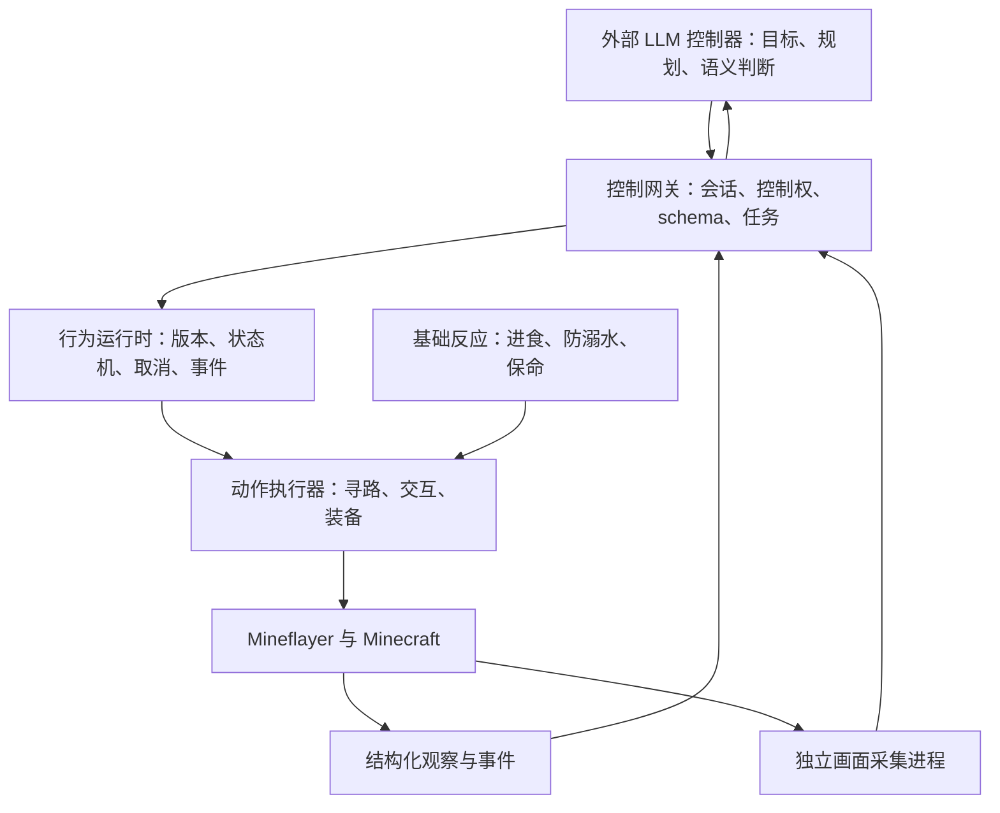

# 外接 LLM 与行为热加载：可行性及实施边界

状态：设计提案，尚未实现行为上传、外部控制会话或画面采集。本次实现的基础是统一动作 schema、参数校验、模型选工具和运行时内存诊断。

## 结论

可行。Astra 或其他 LLM 作为独立控制器，通过稳定协议读取证据、提交任务；Mineflayer 负责连接、物理执行和基础反应。更换模型、任务或行为版本不应要求重新加载 bot_impl。核心驱动升级仍需要代码部署，热加载行为不能替代底层驱动维护。

当前已有 Unix socket 的 observe、tool schema、dry/run 接口。外部程序已经可以通过控制面驱动已实现的动作，无须改代码或 touch open_fire；但这还不是一个具有完整生命周期、抢占和恢复能力的行为运行时。

## 分层

“小脑”是确定性状态机：由血量、饥饿、氧气、伤害事件触发；绝不每个物理 tick 调 LLM。LLM 负责目标分解、观察选择、路径失败后的策略调整、工具组合和新行为定义。

现有 auto-eat、auto-swim、auto-totem 等可复用，但必须统一动作资源仲裁。externalBusy 只有粗粒度忙碌状态，hand-lock 只覆盖部分手部冲突，不能同时解决寻路、视角、双手、窗口、载具等资源竞争。基础反应应能显式抢占任务，并发出 suspended/resumed 事件；不能各模块偷偷改 pathfinder。

## 建议的控制协议（以下均为提案，不是现有 ops）

| 能力 | 请求重点 | 返回重点 |
| --- | --- | --- |
| session.acquire/renew/release | controllerId、TTL | leaseId、expiresAt、epoch |
| observe.snapshot/detail | 所需字段、范围、上限 | snapshotId、timestamp、dimension、结构化数据 |
| events.read | cursor、limit、等待上限 | 事件、nextCursor、是否丢失历史 |
| view.capture | snapshotId、视角、尺寸上限 | frameId、时间、姿态、维度、图像引用或明确 unavailable |
| behavior.validate/install | id、revision、定义、依赖 schema 版本 | 校验结果、版本 hash |
| task.start/status/cancel | leaseId、requestId、行为版本、参数、deadline | taskId、结构化状态、结果与错误 |

任务提交必须快速返回 taskId；长动作不能占住控制请求直到完成。requestId 幂等去重，epoch 隔离重连前的陈旧请求。一个动作资源同一时刻只有一个所有者；内置聊天控制器也必须获取控制权，避免外部 LLM 与聊天 AI 同时移动机器人。

断开模型连接时，租约过期应停止占用资源的动作并释放控制权。进食等基础反应继续工作。取消必须传递到底层寻路/窗口/控制键，并能查询终态；“已取消”不能只代表删掉任务记录。状态与事件存入统一 state，持久日志记录请求、版本、观察引用和迁移；历史必须有数量/时间上限。

## 行为热加载，先实现什么

第一阶段采用有限、可校验的 JSON 状态机，支持 action、wait_event、结构化条件、显式跳转、超时、取消。不要执行模型生成的 eval/require，也不要从步骤说明文本推断下一状态。

行为版本不可变。install 注册新版本，新任务绑定新版本；正在运行的任务继续原版本，或明确取消后重启。共享状态保存 taskId、revision、node、locals、资源占用和迁移序号，不保存作为事实来源的闭包。等待必须有 deadline，所有循环必须可取消。

例如“观察背包 → 移动到坐标 → 存入指定物品 → 完成”可以作为一次行为提交，在游戏侧推进。未知坐标、障碍策略、下一步目标仍交回 LLM；基础动作不等待 LLM 每秒重复发指令。

Lua 可以作为后续可编程层，但不是第一阶段必需。若确有脚本需求，将解释器放在独立进程，通过受限动作协议访问 bot；设置执行时间、内存和指令预算，超时可终止进程。直接把 Lua/JS 放到主事件循环，会让死循环或大对象拖垮 Minecraft keepalive，重演当前要排查的卡顿问题。

当前 agent/runner.js 的技能工厂注册可参考，但它把控制器与定时器挂在 bot._skillRunnerState，包含闭包、轮询和文本 expected 条件；不能直接宣称已具备可回放行为热更新。新运行时应替换这些职责，而非另加一套并行任务真相。

## 文本与画面

默认返回紧凑结构化快照和增量事件。模型按需请求局部实体、背包、容器或画面；无需每轮把所有世界数据和图像灌入上下文。首版先开放结构化证据，等任务闭环可靠后再加入画面。

Mineflayer 本身没有游戏 framebuffer。可以独立渲染已加载区块和实体，提供机器人视角截图；这种图像不等于真实客户端画面，对自定义材质、模组 UI、光照和服务端插件需明确能力限制。需要真实 UI 时，应接一个实际游戏客户端采集端。渲染进程与 bot 进程隔离，避免 GPU/图片编码影响 keepalive。

每帧必须携带采集时间、连接 epoch、维度、位置、yaw/pitch 与关联 snapshotId；动作执行前检查状态是否过期。图像短期缓存并限制大小与数量，返回引用，按模型适配器要求加载。模型自行决定何时看图，但不能把旧图当实时世界事实。

## 实施顺序与验收

1. 控制会话、资源仲裁和 task 生命周期：用离线假时钟覆盖取消、租约过期、重复请求、重连、抢占、任务终态。
2. JSON 行为定义及版本化安装：dry 编译、缺失参数、非法跳转、超时、版本替换与有界历史回放。
3. 外部模型适配器：统一工具协议，结构化观察 → 决策 → 提交任务 → 事件反馈；模型专有 API 留在 bot 之外。
4. 独立画面 sidecar：先做单帧按需采集，验证时间关联、不可用诊断、缓存上限，再评估连续视频的收益与成本。
5. 真人按顺序执行服内验收：单动作、取消、多步行为、模型断线、基础反应抢占。AI 开发验证仍严格只用 dry/mock，不执行 tool.run。

这次不安装控制器、不开放新远程服务，也不执行真人验收。当前控制面是本地 socket；若需要跨机器，应通过明确配置的认证网关转接，不能直接裸露现有 socket 操作到公网。
